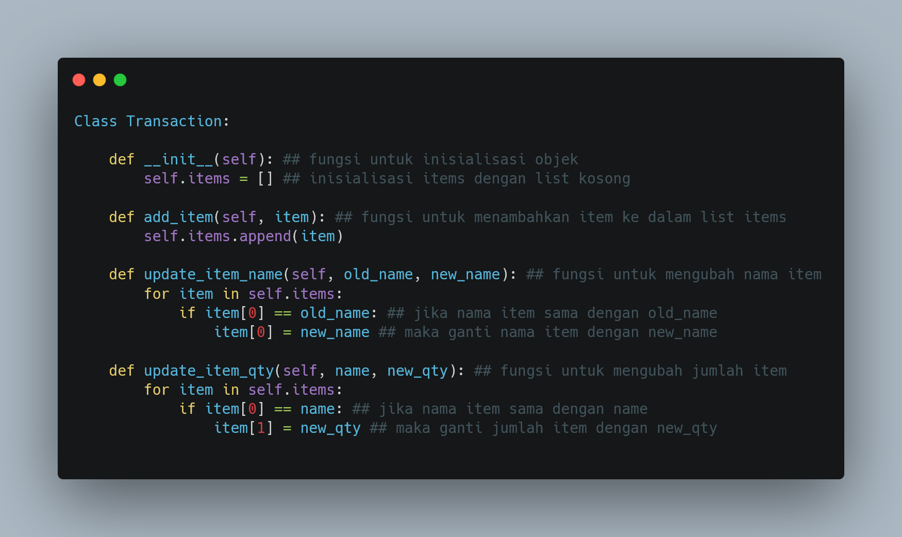
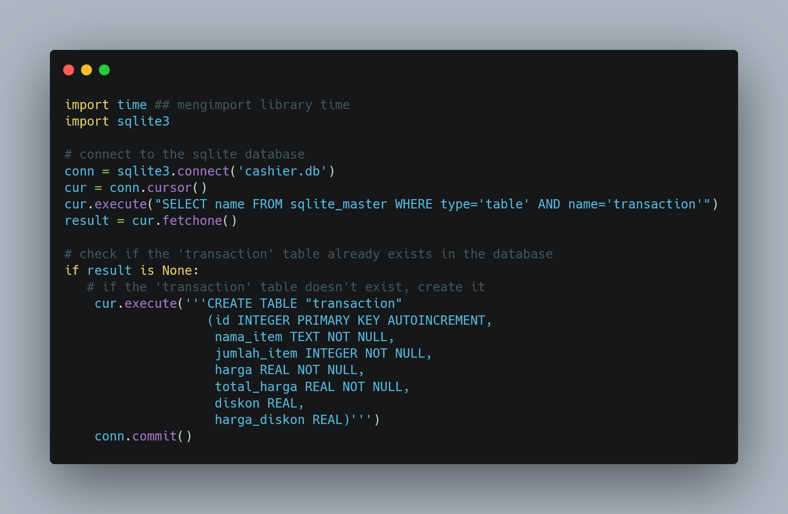

# Python Project Pacmann - Super Cashier!
**This is a part or journey of the Pacmann bootcamp**

  

<h1 align="center">Hi Mate👋, I am Rahmad Gunawan from SDE Batch 01 Pacmann</h1>
<h3 align="center">Python Project I </h3>

By [Rahmad Gunawan](https://www.linkedin.com/in/ragunnn/)
## Dashboard
 Youtube Presentation

**Super Cashier!** is a simple app system that allows customers to input purchased items, quantity, and price. Additionally, it offers other features like payment options and remote purchasing.

## Introduction

The project is to create a self-service checkout system for Andi's large supermarket in Indonesia. The system will allow customers to input purchased items, quantity, and price. Other features like payment options and remote purchasing will be developed. The challenge is finding a programmer to develop the system to meet the supermarket's needs.

## Feature Requirements
---
    - Customer creates a transaction ID by creating an object from the "transaction()" function.
    - Customer inputs the name of the item, quantity, and price of the product by using the "add_item()" method.
    - Customer can update the name, quantity, or price of an item using the "update_item_name()", "update_item_qty()", or "update_item_price()" methods.
    - Customer can delete an item using the "delete_item()" method.
    - Customer can reset the entire transaction by using the "reset_transaction()" method.
    - Customer can check their order using the "check_order()" method, which will return a message indicating if there are any errors in the input data and output the purchased items.
    - Customer can check the total cost of their purchase using the "check_out()" method, which will apply discounts based on the total price and save the transaction data into an SQLite database.
    - The transaction data saved into the database will include the transaction ID, item name, quantity, price, total price, discount, and discounted price.
    - Additional features can be added as needed to improve the system.

 ## Here's how to use the program:
   
    Download all Python files/modules into a local directory.
    Open your terminal and navigate to the local directory.
    Run the Python script by typing "python script.py" in the terminal.
    Follow the prompts to input your order details.
    Enjoy using the program!

 ## Program Flow

    1. The first step is to import two libraries: 'time' and 'sqlite3'.

  
  

  Asset Recommendation Page

    Then, we establish a connection to a SQLite database called 'cashier.db' and check if the 'transaction' table exists. If it doesn't exist, we create the table with the same name.
    Next, we create a class called Transaction that contains several methods:
        The 'init()' method is used to initialize an object of the class. In this method, we initialize the 'items' attribute as an empty list.
        The 'add_item()' method is used to add an item to the 'items' list.
        The 'update_item_name()' method is used to update the name of an item.
        The 'update_item_qty()' method is used to update the quantity of an item.
        The 'update_item_price()' method is used to update the price of an item.
        The 'delete_item()' method is used to delete an item from the 'items' list.
        The 'reset_transaction()' method is used to reset the transaction by clearing the 'items' list.
        The 'check_order()' method is used to check the order. If there is an error in the input data, it will return an error message. If there is no error, it will return a success message.
        The 'check_out()' method is used to calculate the total price and discount given. The total price and discount are calculated based on the total price of the items that have been inputted. A discount is given if the total price is greater than 200000, 300000, or 500000.
        The 'print_transaction()' method is used to print the transaction to the screen in a table format.
        The 'insert_to_table()' method is used to save the transaction to the 'transaction' table in the SQLite database. In this method, each item that has been inputted will be saved to the 'transaction' table along with the quantity of the item, the item price, the total price, the discount, and the price after the discount.
    After creating the Transaction class, we can initialize an object by calling the class constructor: 'transaksi = Transaction()'.
    We can then perform various operations on the 'transaksi' object, such as adding an item, updating the name of an item, updating the quantity of an item, updating the price of an item, deleting an item, resetting the transaction, checking the order, calculating the total price and discount, printing the transaction, and saving the transaction to the database.
  Here's how to use the program:
---

  
  

  Asset Recommendation Page

## Test Case
1. [Rahmad Gunawan, Github (Link)](https://github.com/rahmad07g)
2. [Suhardiman, Github (Link](https://github.com/sumankwan)

  
  

  
  

